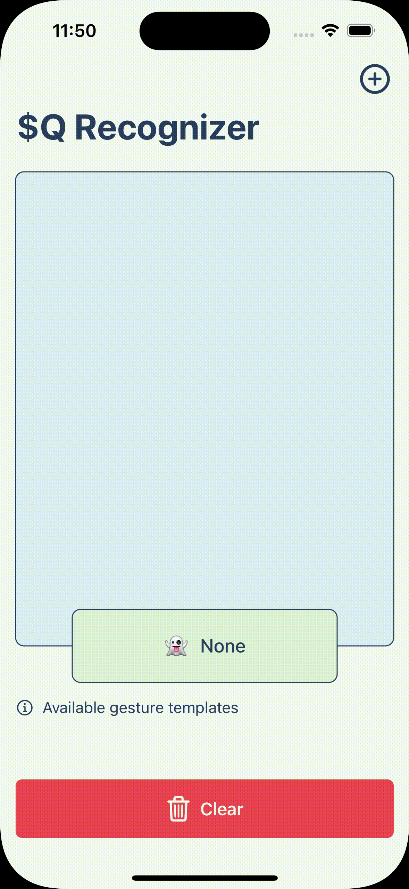

# The $Q Super-Quick Recognizer

## Swift Version

The **$Q Super-Quick Recognizer** is a 2-D gesture recognizer designed for rapid prototyping of gesture-based user interfaces, especially on low-power mobiles and wearables. It builds upon the \$P Point-Cloud Recognizer but optimizes it to achieve a whopping 142x speedup, even while improving its accuracy slightly.

[The official page](https://depts.washington.edu/acelab/proj/dollar/qdollar.html) of the algorithm.
 

## Original $Q authors
---
 
* **Radu-Daniel Vatavu, Ph.D**.
University Stefan cel Mare of Suceava
Suceava 720229, Romania
<radu.vatavu@usm.ro>

* **Lisa Anthony, Ph.D.**
Department of CISE
University of Florida
Gainesville, FL, USA 32611
<lanthony@cise.ufl.edu>

* **Jacob O. Wobbrock, Ph.D.**
The Information School | DUB Group
University of Washington
Seattle, WA, USA 98195-2840
<wobbrock@uw.edu>
  
## The academic publication for the $Q recognizer
---

Vatavu, R.-D., Anthony, L. and Wobbrock, J.O. (2018). $Q: A super-quick, articulation-invariant stroke-gesture recognizer for low-resource devices. Proceedings of the ACM Conference on Human-Computer Interaction with Mobile Devices and Services (MobileHCI '18). Barcelona, Spain (September 3-6, 2018). New York: ACM Press. Article No. 23. <https://dl.acm.org/citation.cfm?id=3229434.3229465>

